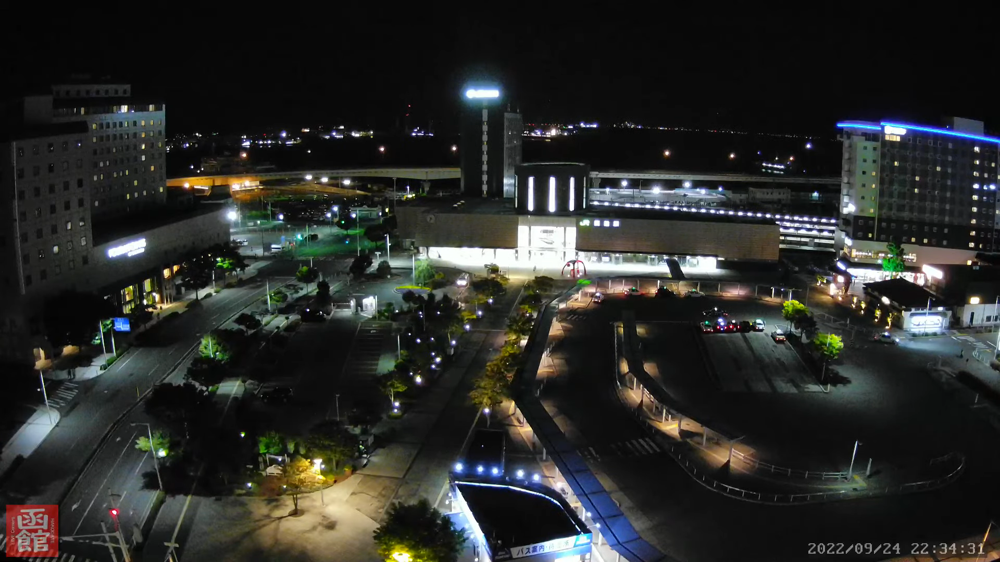
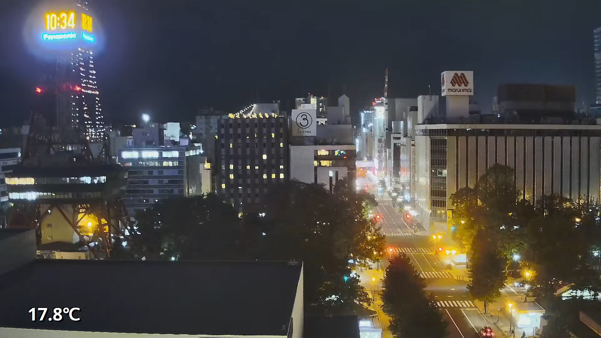
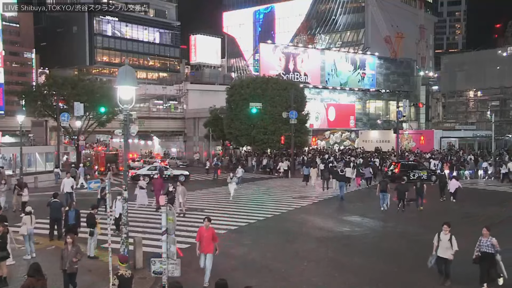
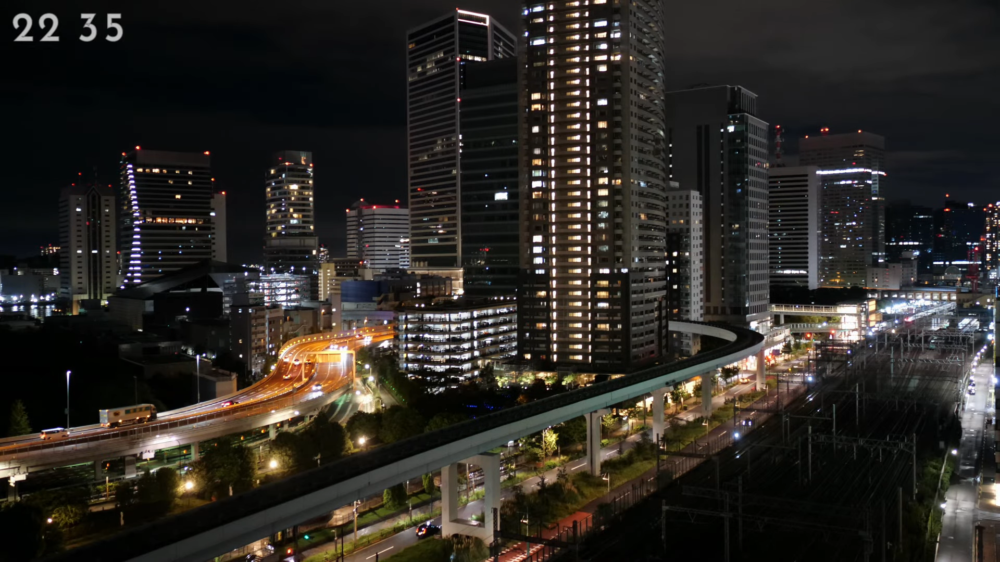
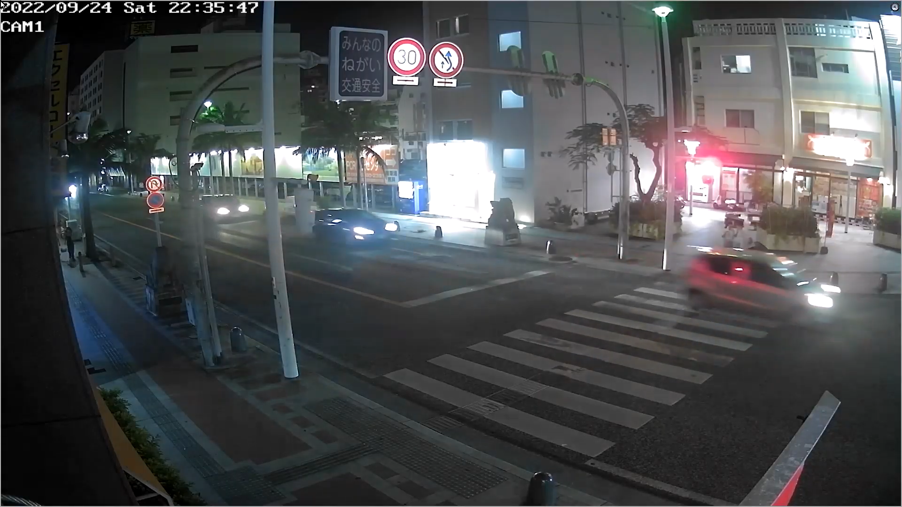
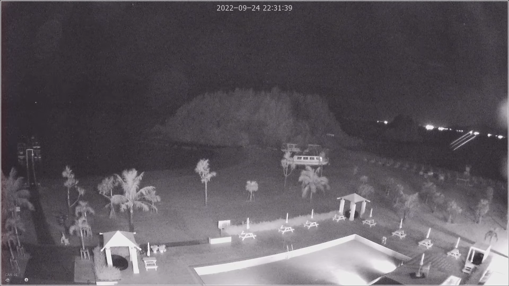

|　　　　　　　　　　　|       函館 Hakodate         |          札幌 Sapporo            |
| :----------------: | :----------------------------: | :--------------------------------: |
| 北海道 Hokkaido |  |  |

|　　　　　　　　|        渋谷 Shibuya            |         汐留 Shiodome       |
| :-----------: | :------------------------------: | :----------------------------: |
| 東京 Tokyo |  |  |

|　　　　　　　    | 那覇 Naha | 恩納村 Onnason |
| :-------------: | :---------: | :---------------: |
| 沖縄 Okinawa |  |  |