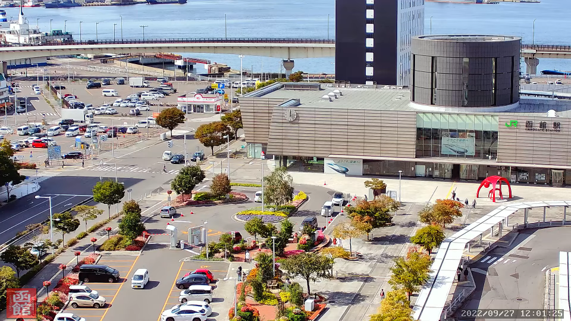
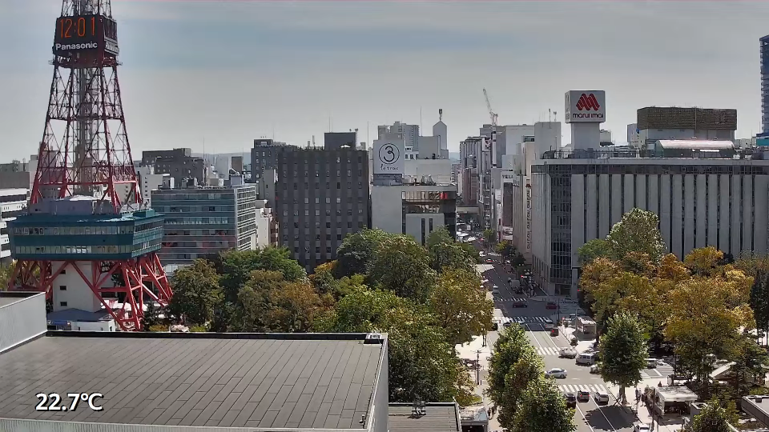
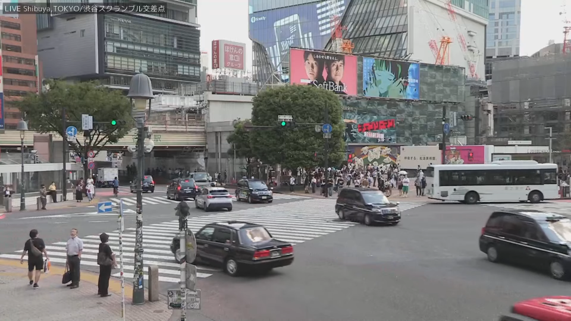
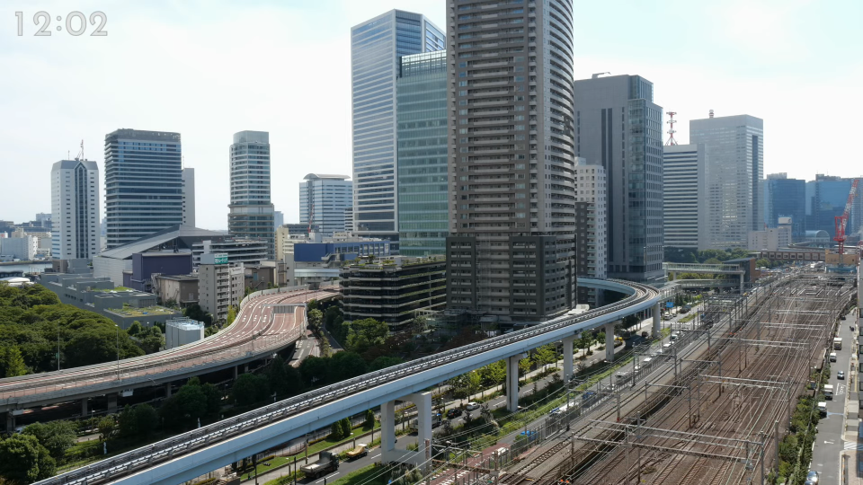
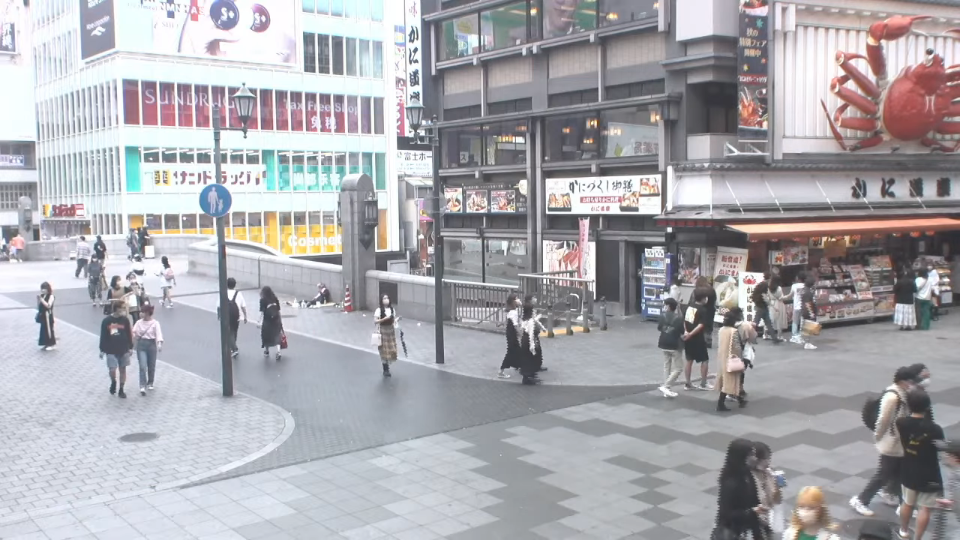
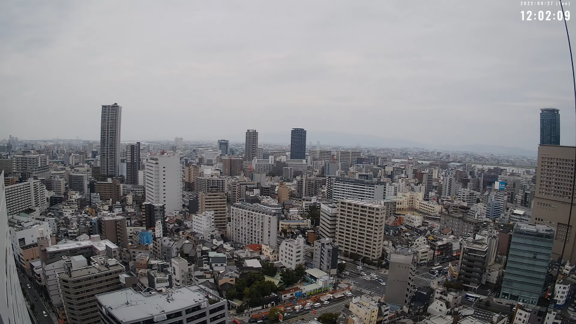
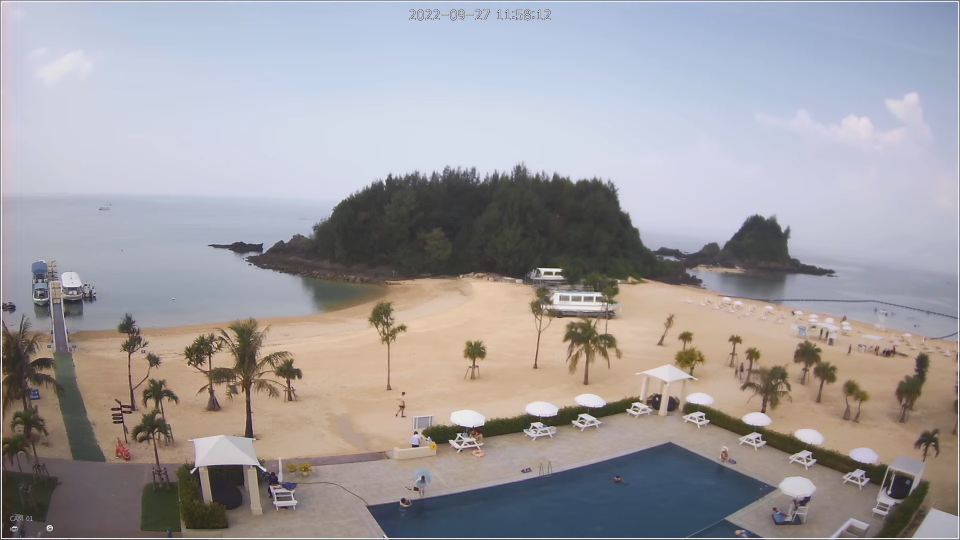
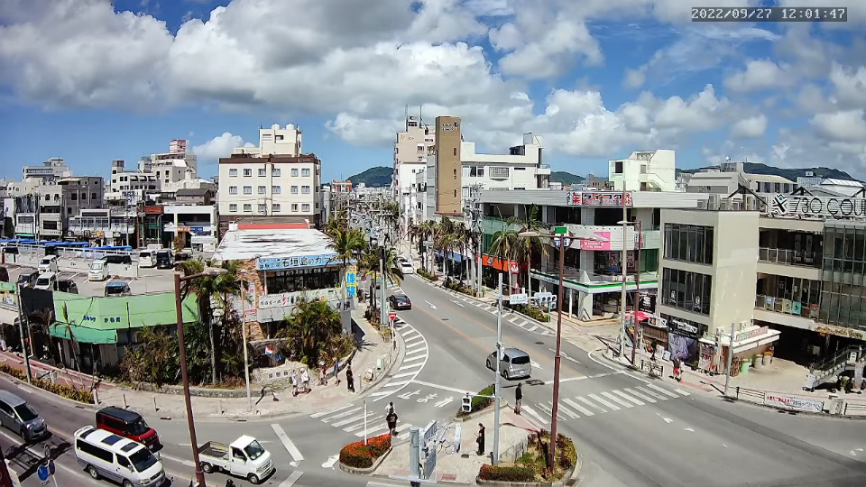

<table>
   <thead>
      <tr>
         <th colspan="4" align="center">北海道 Hokkaido</th>
      </tr>
      <tr>
         <th colspan="2" align="center">函館 Hakodate</th>
         <th colspan="2" align="center">札幌 Sapporo</th>
      </tr>
      <tr>
         <th align="center"></th>
         <th align="center">
            <h3>21.48°C</h3>
         </th>
         <th align="center"></th>
         <th align="center">
            <h3>21.22°C</h3>
         </th>
      </tr>
   </thead>
   <tbody>
      <tr>
         <td colspan="2" align="center"></td>
         <td colspan="2" align="center"></td>
      </tr>
   </tbody>
</table>

<table>
   <thead>
      <tr>
         <th colspan="4" align="center">東京 Tokyo</th>
      </tr>
      <tr>
         <th colspan="2" align="center">渋谷 Shibuya</th>
         <th colspan="2" align="center">汐留 Shiodome</th>
      </tr>
      <tr>
         <th align="center"></th>
         <th align="center">
            <h3>29°C</h3>
         </th>
         <th align="center"></th>
         <th align="center">
            <h3>29.09°C</h3>
         </th>
      </tr>
   </thead>
   <tbody>
      <tr>
         <td colspan="2" align="center"></td>
         <td colspan="2" align="center"></td>
      </tr>
   </tbody>
</table>

<table>
   <thead>
      <tr>
         <th colspan="4" align="center">大阪府 Osaka</th>
      </tr>
      <tr>
         <th colspan="2" align="center">道頓堀 Dotonbori</th>
         <th colspan="2" align="center">大阪市 Osaka</th>
      </tr>
      <tr>
         <th align="center"></th>
         <th align="center">
            <h3>32.52°C</h3>
         </th>
         <th align="center"></th>
         <th align="center">
            <h3>29.4°C</h3>
         </th>
      </tr>
   </thead>
   <tbody>
      <tr>
         <td colspan="2" align="center"></td>
         <td colspan="2" align="center"></td>
      </tr>
   </tbody>
</table>

<table>
   <thead>
      <tr>
         <th colspan="4" align="center">沖縄 Okinawa</th>
      </tr>
      <tr>
         <th colspan="2" align="center">かりゆしビーチ Kariyushi Beach</th>
         <th colspan="2" align="center">石垣島 Ishigaki Island</th>
      </tr>
      <tr>
         <th align="center"></th>
         <th align="center">
            <h3>32.99°C</h3>
         </th>
         <th align="center"></th>
         <th align="center">
            <h3>29.99°C</h3>
         </th>
      </tr>
   </thead>
   <tbody>
      <tr>
         <td colspan="2" align="center"></td>
         <td colspan="2" align="center"></td>
      </tr>
   </tbody>
</table>

-----------------------------------------------------------------------------

Last Updated: 2022/09/27 12:00:17 (JST) Update Cycle: Every 30 min

   

