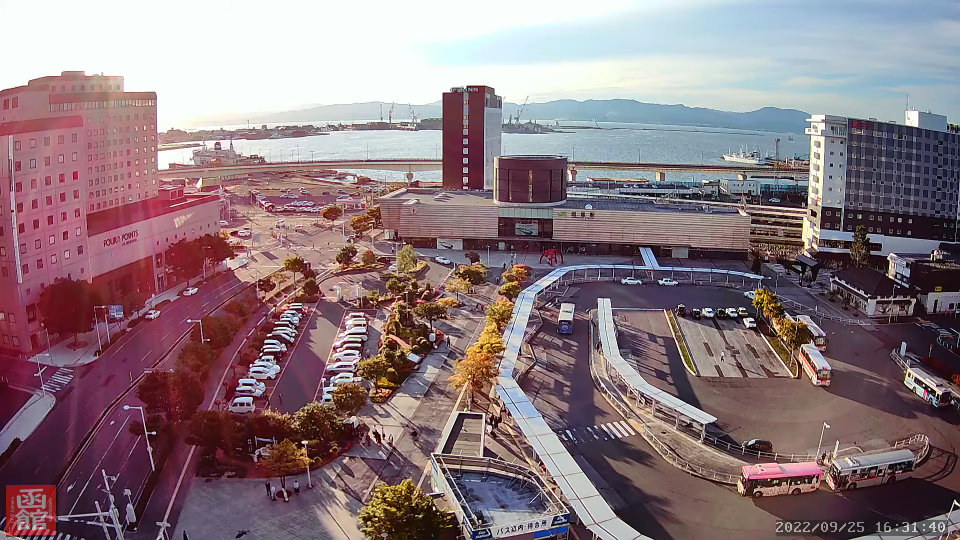
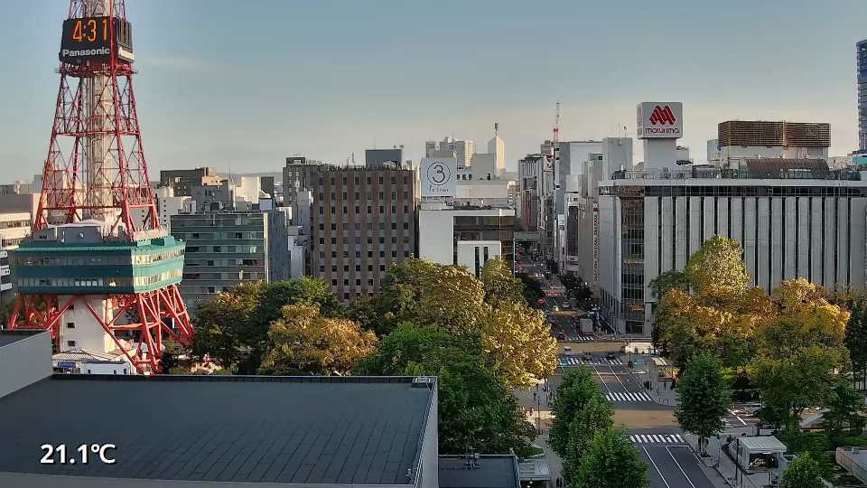
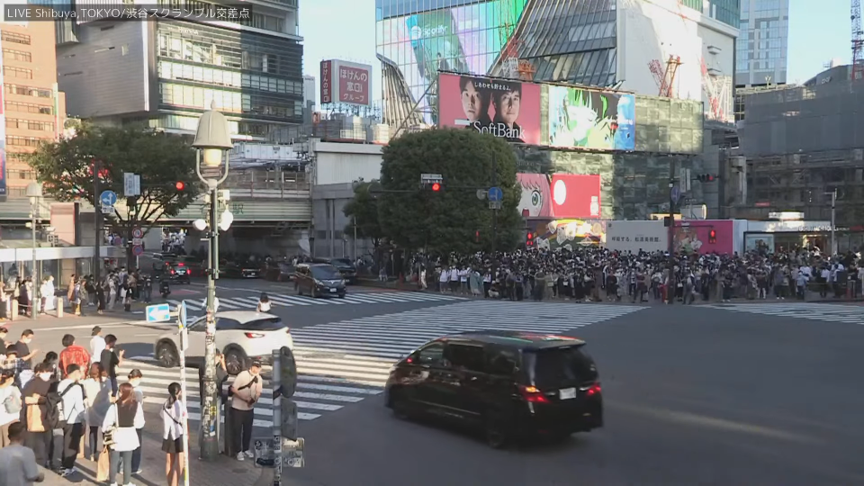
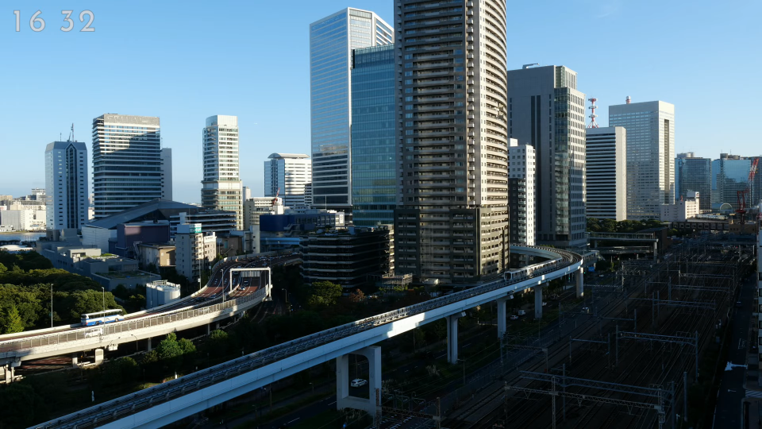
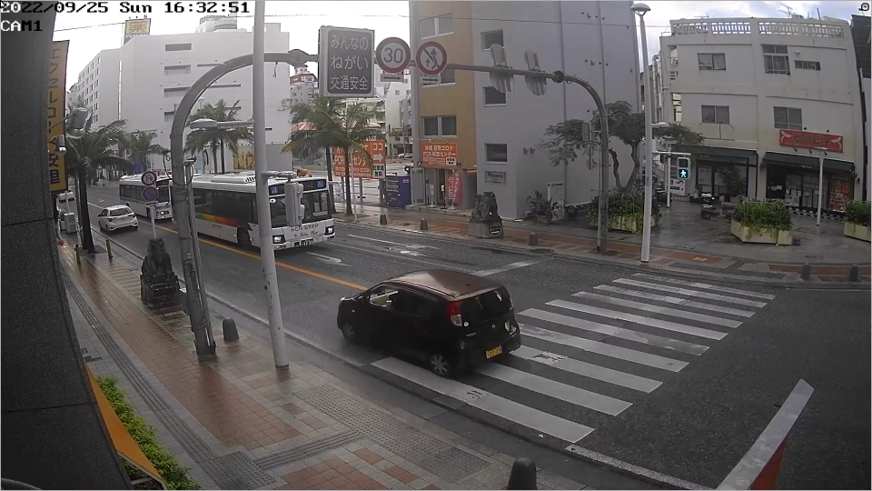
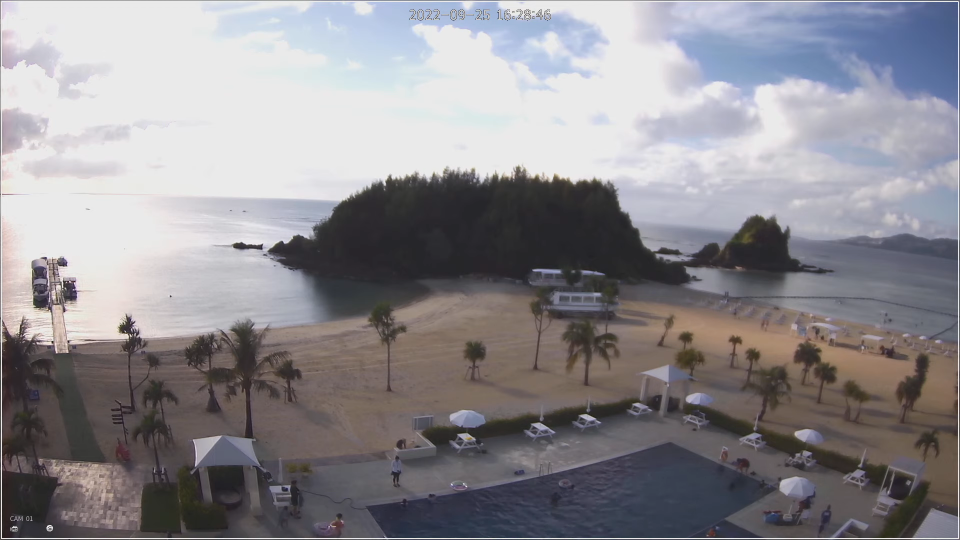

<table>
   <thead>
      <tr>
         <th colspan="2" align="center">北海道 Hokkaido</th>
      </tr>
      <tr>
         <th align="center">函館 Hakodate</th>
         <th align="center">札幌 Sapporo</th>
      </tr>
   </thead>
   <tbody>
      <tr>
         <td align="center"></td>
         <td align="center"></td>
      </tr>
   </tbody>
</table>

<table>
   <thead>
      <tr>
         <th colspan="2" align="center">東京 Tokyo</th>
      </tr>
      <tr>
         <th align="center">渋谷 Shibuya</th>
         <th align="center">汐留 Shiodome</th>
      </tr>
   </thead>
   <tbody>
      <tr>
         <td align="center"></td>
         <td align="center"></td>
      </tr>
   </tbody>
</table>

<table>
   <thead>
      <tr>
         <th colspan="2" align="center">沖縄 Okinawa</th>
      </tr>
      <tr>
         <th align="center">那覇 Naha</th>
         <th align="center">恩納村 Onna-son</th>
      </tr>
   </thead>
   <tbody>
      <tr>
         <td align="center"></td>
         <td align="center"></td>
      </tr>
   </tbody>
</table>

-----------------------------------------------------------------------------

Last Updated: 2022/09/25 16:30:22 (JST) Update Cycle: Every 30 min

  

