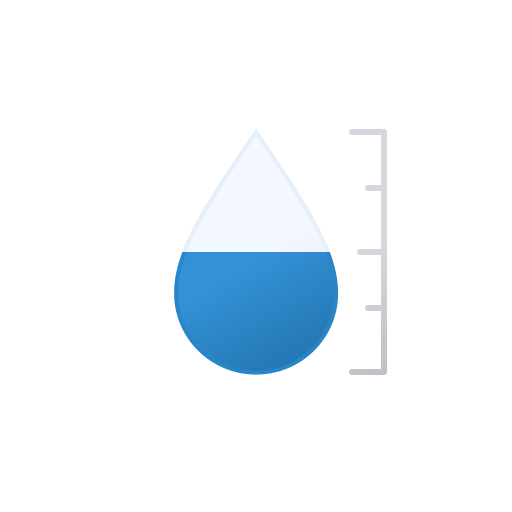
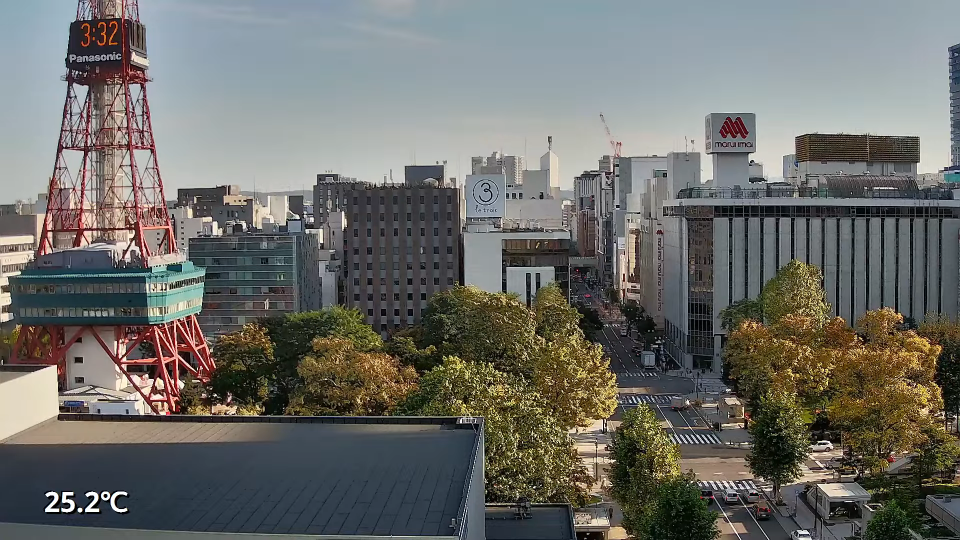
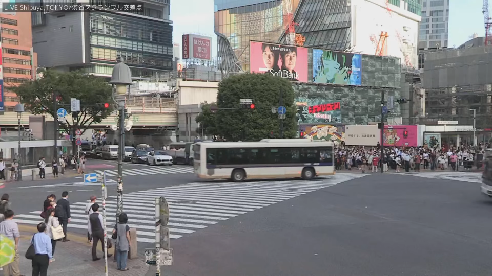
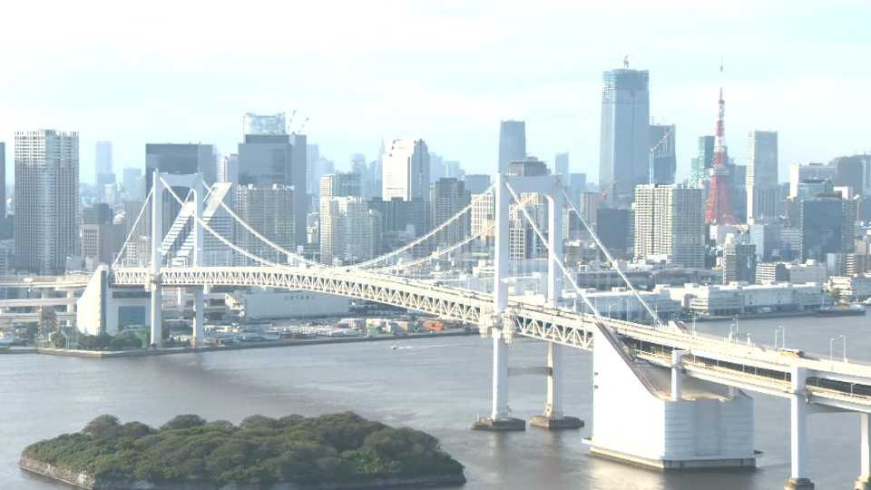
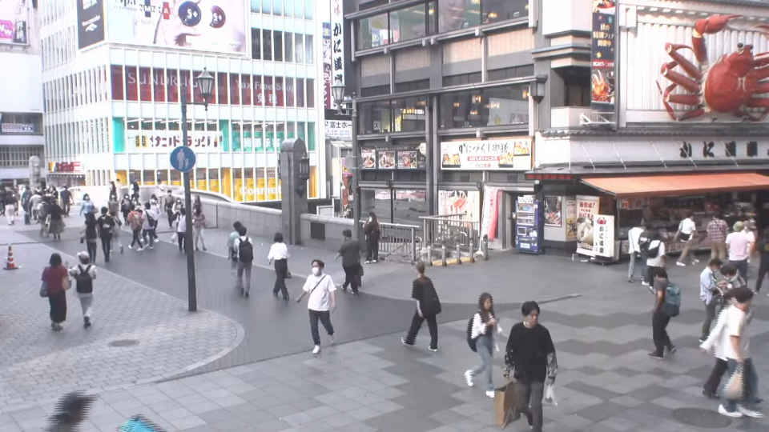
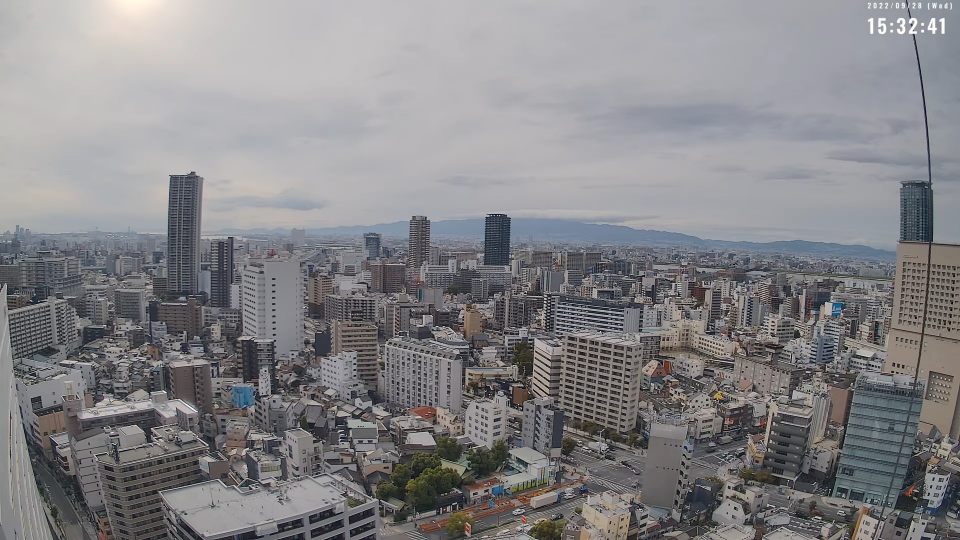
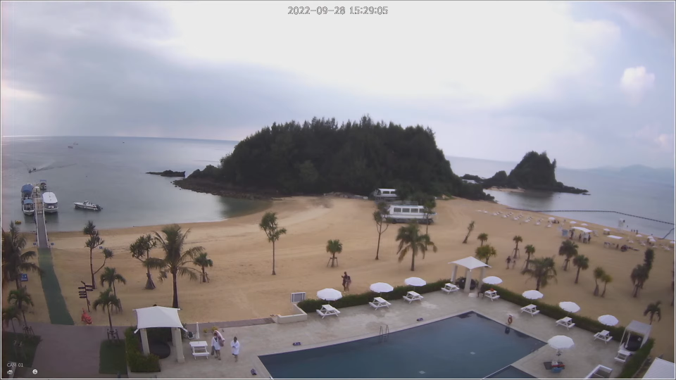
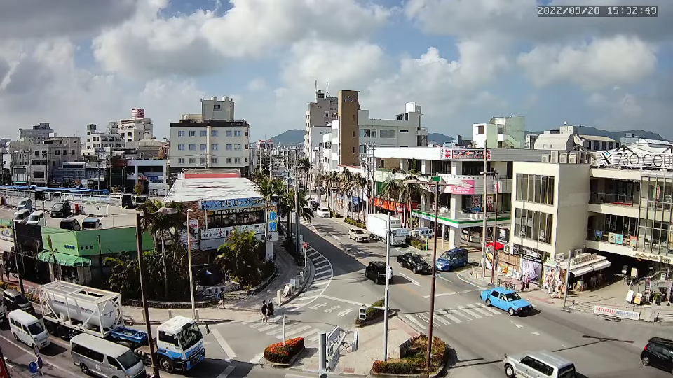

<table>
  <thead>
    <tr>
      <th colspan="8" align="center">
        北海道 
        Hokkaido
      </th>
    </tr>
    <tr>
      <th colspan="4" align="center">
        函館 
        Hakodate
      </th>
      <th colspan="4" align="center">
        札幌 
        Sapporo
      </th>
    </tr>
    <tr>
      <th align="center">
        &emsp;&emsp; 
          
        &emsp;&emsp;
      </th>
      <th align="center">
        
         
        23°C
      </th>
      <th align="center">
        
         
        60%
      </th>
      <th align="center">
        
         
        2m/s
      </th>
      <th align="center"></th>
      <th align="center">
        
         
        26°C
      </th>
      <th align="center">
        
         
        39%
      </th>
      <th align="center">
        
         
        2m/s
      </th>
    </tr>
  </thead>
  <tbody>
    <tr>
      <td colspan="4" align="center"></td>
      <td colspan="4" align="center"></td>
    </tr>
  </tbody>
</table>

<table>
  <thead>
    <tr>
      <th colspan="8" align="center">
        東京 
        Tokyo
      </th>
    </tr>
    <tr>
      <th colspan="4" align="center">
        渋谷 
        Shibuya
      </th>
      <th colspan="4" align="center">
        お台場 
        Odaiba
      </th>
    </tr>
    <tr>
      <th align="center">
        &emsp;&emsp; 
          
        &emsp;&emsp;
      </th>
      <th align="center">
        
         
        27°C
      </th>
      <th align="center">
        
         
        38%
      </th>
      <th align="center">
        
         
        1m/s
      </th>
      <th align="center"></th>
      <th align="center">
        
         
        27°C
      </th>
      <th align="center">
        
         
        38%
      </th>
      <th align="center">
        
         
        1m/s
      </th>
    </tr>
  </thead>
  <tbody>
    <tr>
      <td colspan="4" align="center"></td>
      <td colspan="4" align="center"></td>
    </tr>
  </tbody>
</table>

<table>
  <thead>
    <tr>
      <th colspan="8" align="center">
        大阪府 
        Osaka
      </th>
    </tr>
    <tr>
      <th colspan="4" align="center">
        道頓堀 
        Dotonbori
      </th>
      <th colspan="4" align="center">
        大阪市 
        Osaka
      </th>
    </tr>
    <tr>
      <th align="center">
        &emsp;&emsp; 
         
        &emsp;&emsp;
      </th>
      <th align="center">
        
         
        27°C
      </th>
      <th align="center">
        
         
        62%
      </th>
      <th align="center">
        
         
        3m/s
      </th>
      <th align="center"></th>
      <th align="center">
        
         
        27°C
      </th>
      <th align="center">
        
         
        62%
      </th>
      <th align="center">
        
         
        3m/s
      </th>
    </tr>
  </thead>
  <tbody>
    <tr>
      <td colspan="4" align="center"></td>
      <td colspan="4" align="center"></td>
    </tr>
  </tbody>
</table>

<table>
  <thead>
    <tr>
      <th colspan="8" align="center">
        沖縄 
        Okinawa
      </th>
    </tr>
    <tr>
      <th colspan="4" align="center">
        かりゆしビーチ 
        Kariyushi Beach
      </th>
      <th colspan="4" align="center">
        石垣島 
        Ishigaki Island
      </th>
    </tr>
    <tr>
      <th align="center">
        &emsp;&emsp; 
         
        &emsp;&emsp;
      </th>
      <th align="center">
        
         
        29°C
      </th>
      <th align="center">
        
         
        73%
      </th>
      <th align="center">
        
         
        4m/s
      </th>
      <th align="center"></th>
      <th align="center">
        
         
        31°C
      </th>
      <th align="center">
        
         
        73%
      </th>
      <th align="center">
        
         
        4m/s
      </th>
    </tr>
  </thead>
  <tbody>
    <tr>
      <td colspan="4" align="center"></td>
      <td colspan="4" align="center"></td>
    </tr>
  </tbody>
</table>

-----------------------------------------------------------------------------

  Last Updated: 2022/09/28 15:30:43 (JST) 
  Update Cycle: 15 min

  

